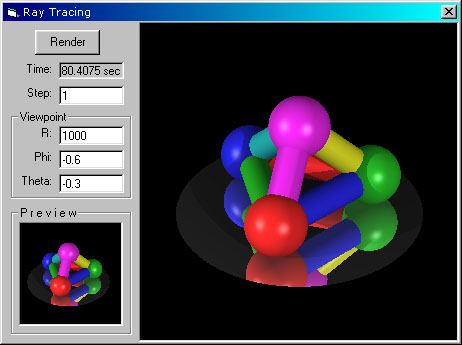



## RayTrace 1\.1\.14

### Description

This is the 3th submit of my great ray tracing code. Now it features:

* Scanline culling (more speed)

* Reflective objects

* Diffuse lighting

* Specular lighting

* Ambient lighting

* Sphere objects

* Cylinder objects

* Disk objects

* plane objects

Please vote for this great code!
 
### More Info
 

             |
---                |---
**Submitted On**   |2000-12-16 18:56:48
**By**             |[Filip](https://github.com/Planet-Source-Code/PSCIndex/blob/master/ByAuthor/filip.md)
**Level**          |Advanced
**User Rating**    |4.9 (142 globes from 29 users)
**Compatibility**  |VB 5\.0, VB 6\.0
**Category**       |[Graphics](https://github.com/Planet-Source-Code/PSCIndex/blob/master/ByCategory/graphics__1-46.md)
**World**          |[Visual Basic](https://github.com/Planet-Source-Code/PSCIndex/blob/master/ByWorld/visual-basic.md)
**Archive File**   |[CODE\_UPLOAD1274612162000\.zip](https://github.com/Planet-Source-Code/filip-raytrace-1-1-14__1-13637/archive/master.zip)

